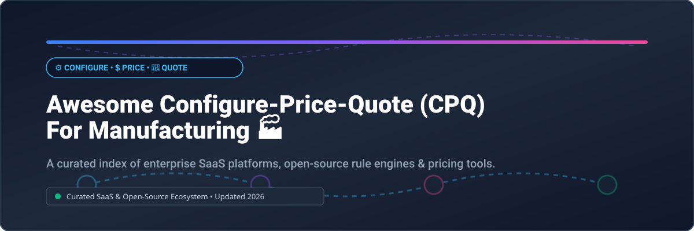

# Awesome Configure-Price-Quote (CPQ) for Manufacturing 🏭

  
  
  
  

## 📌 Top Configure-Price-Quote (CPQ) & Product Configurator Ecosystem for Manufacturing 🚀

**A Comprehensive, Curated Index of Enterprise SaaS Platforms & Open-Source GitHub Repositories**

*Optimized for Product Configuration, Dynamic Pricing Engines, CAD Automation, Quote Generation & Manufacturing ERP/CRM Integration.*

---

### 🌐 Market Overview & Sector Insights 📊
The global **Configure, Price, and Quote (CPQ)** software market for manufacturing is valued at **$3.9 Billion (2026)** and is projected to surpass **$8.5 Billion** by 2031, growing at a CAGR of ~16.5%. 

The sector is **moderately to highly fragmented**. While enterprise CRM giants (Salesforce, SAP, Oracle) maintain standard CPQ modules, specialized "best-of-breed" vendors (Tacton, Epicor, PROS, Conga) lead high-complexity manufacturing niches involving 3D visual configurators, CAD design automation (DriveWorks), and Engineer-to-Order (ETO) workflows.

---

## 📑 Table of Contents 📚
- [🏢 Enterprise SaaS & Hosted Platforms](#-enterprise-saas--hosted-platforms)
- [💻 Open-Source GitHub Projects](#-open-source-github-projects)
- [🤝 How to Contribute](#-how-to-contribute)
- [⚠️ Disclaimer](#%EF%B8%8F-disclaimer)
- [💖 Support](#-support)
- [📈 Star History](#-star-history)

---

## 🏢 Enterprise SaaS & Hosted Platforms 💼

Below is a breakdown of key commercial manufacturing CPQ solutions, sorted by **Company Size / Annual Revenue (Descending)**.

| Vendor / Platform 🏷️ | Scale / Valuation / Revenue 💰 | Pricing Model & Starting Tier 💳 | Free Tier / Trial Limits ⏳ | Core Focus & Features ⚙️ |
| :--- | :--- | :--- | :--- | :--- |
| **[Epicor CPQ](https://www.epicor.com/)** | **>$1 Billion** ARR | Contact for Enterprise Quote (Est. ~$150/user/mo) | No Free Trial (Custom Demo Available) | Complete ERP integration, 2D/3D visual configurator, CAD automation (formerly KBMax). |
| **[PROS Smart CPQ](https://www.pros.com/)** | **~$330 Million** ARR ($1.4B Valuation) | Contact for Enterprise Quote (Est. ~$95/user/mo) | No Free Trial (Custom Demo Available) | AI-driven pricing optimization, omnichannel quoting for global B2B manufacturing. |
| **[Conga CPQ](https://conga.com/)** | **~$198 Million** ARR | Contact for Enterprise Quote (Est. ~$35–$85/user/mo) | No Free Trial (Interactive Sandbox on request) | Integrated Revenue Lifecycle Management (RLM), CLM, dynamic document generation. |
| **[Logik.io](https://www.logik.io/)** | **~$60 Million** (Valuation / Raised $45M+) | Contact for Enterprise Quote | No Free Trial (Custom Demo Available) | Headless, API-first high-speed configuration engine built for complex products. |
| **[Tacton CPQ](https://www.tacton.com/)** | **~$40 Million** ARR | Contact for Enterprise Quote (Est. ~$100–$200/user/mo) | No Free Trial (Custom Demo Available) | Deep CAD/ETO configuration, 3D visualization, self-service manufacturing configurator. |
| **[Experlogix](https://www.experlogix.com/)** | **~$35 Million** ARR | Contact for Enterprise Quote (Est. ~$109/user/mo) | 30-Day Free Trial (Doc Automation only; CPQ by Demo) | Deep Microsoft Dynamics & Salesforce CPQ integration, rule builder. |
| **[Configure One](https://www.configureone.com/)** | **~$25 Million** ARR (Revalize) | Contact for Enterprise Quote (Est. ~$150/user/mo) | No Free Trial (Custom Demo Available) | Web-based product configurator, automated BOM generation, production workflow. |
| **[DriveWorks](https://www.driveworks.co.uk/)** | **~$15 Million** ARR | Modular Licensing (Solo / Pro / Live) | 30-Day Free Trial (DriveWorks Solo) | SOLIDWORKS design automation, rule-based CPQ engine for custom manufacturing. |
| **[Sofon](https://www.sofon.com/)** | **~$10 Million** ARR | Contact for Enterprise Quote | No Free Trial (Custom Demo Available) | Guided selling, complex constraint solver for industrial machinery manufacturers. |

---

## 💻 Open-Source GitHub Projects 🔓

The open-source ecosystem provides modular building blocks—ranging from manufacturing ERPs with built-in configurators to standalone pricing engines and JSON logic solvers.

Projects below are sorted by **GitHub Stars (Descending)** 🌟.

- **[FlexPrice](https://github.com/flexprice/flexprice)**   
  Open-source pricing engine and usage-based billing infrastructure. Highly adaptable for complex manufacturing quote calculations, dynamic meter tracking, and tier-based pricing logic. **Apache-2.0**.

- **[Carbon](https://github.com/crbnos/carbon)**   
  The open-source operating system for manufacturing. Features ERP, MES, QMS, and a built-in **Configure-to-Order (CTO) Product Configurator**. Handles multi-level BoMs, capacity planning, MRP, and MCP client/server integration. **AGPL-3.0**.

- **[OpenMeter](https://github.com/openmeterio/openmeter)**   
  Real-time metering and pricing calculation engine. Useful for complex manufacturing CPQ implementations requiring real-time usage metrics or dynamic cost calculation. **Apache-2.0**.

- **[Lotus](https://github.com/uselotus/lotus)**   
  Open-source pricing, packaging, and quote calculation engine. Supports custom pricing rules, plan management, and CRM/payment integrations. **MIT**.

- **[OCA Product Configurator](https://github.com/OCA/product-configurator)**   
  Comprehensive Odoo ERP product configurator module. Enables dynamic variant creation, attribute-based price extra charges, and constraint rules for manufacturing lines. **AGPL-3.0**.

- **[datalogic-rs](https://github.com/GoPlasmatic/datalogic-rs)**   
  High-performance JSONLogic rule engine with WASM and multi-language bindings. Includes a React visual rule builder for non-engineers to maintain product configuration constraints and fee schedules. **MIT**.

- **[openCPQ](https://github.com/webXcerpt/openCPQ)**   
  Browser-based client-side product configuration framework. Runs configuration logic directly in JS/TypeScript without requiring server round-trips. **MIT**.

- **[SwiftCPQ](https://github.com/ekky1328/SwiftCPQ)**   
  Vendor-agnostic lightweight CPQ proposal and quoting frontend built with Vue.js. **MIT**.

- **[rule-lite](https://github.com/tejas821/rule-lite)**   
  Tiny (~1KB) dependency-free TypeScript JSON rule engine for evaluating conditional logic (AND/OR/NOT) in product configuration forms and feature constraints. **MIT**.

---

## 🤝 How to Contribute 🛠️

Contributions are welcome and appreciated! Follow these steps to submit a tool or project:

1. Fork this repository. 🍴
2. Edit `README.md` following the tabular or bulleted format. 📝
3. Provide factual info: name, link, 1–2 sentence description, star counts, and license. 🔗
4. Open a Pull Request (PR) with a clear title. 🚀

---

## ⚠️ Disclaimer 📑

- This curated list is maintained by the community for informational and research purposes only.
- CPQ software handles mission-critical catalog, CAD, and pricing data; evaluate compliance and security before deployment.
- Check out the main list of awesome projects at [Awesome-Awesome-Awesome](https://github.com/ishandutta2007/Awesome-Awesome-Awesome).

---

## 💖 Support 🙏

If you find this repository helpful for your manufacturing project, business, or research, please consider supporting it!

- 🌟 **Star** this repository to help others discover it.
- 🔀 **Fork** and contribute new CPQ tools or pricing engines.
- 📢 **Share** with your engineering, sales ops, and manufacturing tech network!
- ☕ **Buy me a coffee / Sponsor**: Support ongoing maintenance on [GitHub Sponsors](https://github.com/sponsors/ishandutta2007).

---

## 📈 Star History

